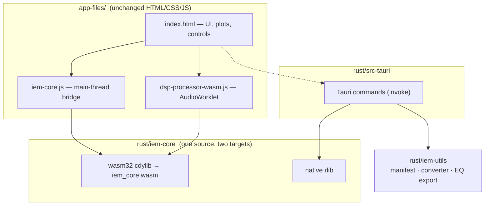

<div align="center">

# 🎧 IEM-Tool-rs

**A Rust rewrite of the [IEM Tool](https://github.com/MyLittlePrimordia/IEM-Tool) DSP core — parametric EQ & frequency-response analysis for in-ear monitors, in a native Tauri desktop app.**

[](https://github.com/Londopy/IEM-Tool-rs/actions/workflows/ci.yml)
[](https://github.com/Londopy/IEM-Tool-rs/actions/workflows/release.yml)
[](https://github.com/Londopy/IEM-Tool-rs/releases/latest)
[](https://github.com/Londopy/IEM-Tool-rs/releases)

[](LICENSE)
[](https://www.rust-lang.org/)
[](https://tauri.app/)
[](https://webassembly.org/)
[](#-platforms--downloads)
[](#-testing--verification)

[**Download**](https://github.com/Londopy/IEM-Tool-rs/releases/latest) · [**What's different**](#-whats-different-from-the-original) · [**Build**](#-building-from-source) · [**Architecture**](#-architecture) · [**Credits**](CREDITS.md)

</div>

---

> ### 🙏 Credit where it's due
> This project is built on **[IEM Tool](https://github.com/MyLittlePrimordia/IEM-Tool) by [MyLittlePrimordia](https://github.com/MyLittlePrimordia)**.
> The **entire user interface** — the HTML/CSS/JS frontend, the app design, the
> review-card themes, the visualizers, and the measurement-curve library — is
> their original work, used here under the MIT License. All credit for the app's
> look, feel, and features belongs to them. Please ⭐ [the original project](https://github.com/MyLittlePrimordia/IEM-Tool).
>
> **What this repo adds:** the computational core, DSP engine, utilities, and
> desktop shell rewritten in **Rust**, plus cross-platform CI and releases.
> See **[CREDITS.md](CREDITS.md)** for a precise, file-by-file breakdown.

---

## 📖 Contents

- [What is this?](#-what-is-this)
- [What's different from the original](#-whats-different-from-the-original)
- [Features](#-features)
- [Platforms & downloads](#-platforms--downloads)
- [Installation](#-installation)
- [Verifying your download](#-verifying-your-download)
- [Building from source](#-building-from-source)
- [Architecture](#-architecture)
- [Performance](#-performance)
- [Command-line utilities](#-command-line-utilities)
- [Testing & verification](#-testing--verification)
- [Project layout](#-project-layout)
- [Contributing](#-contributing)
- [License & attribution](#-license--attribution)

---

## 🔍 What is this?

**IEM Tool** is an all-in-one offline application for reviewing, tuning, testing
and comparing in-ear monitors — a parametric EQ, an AutoEQ solver, a frequency-response
analyser, a blind A/B tester, and a library of ~10,600 measurement curves, all in
one desktop app that never touches the network.

**IEM-Tool-rs** keeps that application exactly as it is, and replaces everything
underneath it:

- The **DSP and analysis core** — biquad filter design, the real-time audio
  engine, frequency-response evaluation, curve maths and the AutoEQ solver — was
  rewritten in **Rust**, verified numerically against the original JavaScript.
- The **desktop shell** moved from **Electron to Tauri**, dropping the bundled
  Chromium in favour of the OS-native webview.
- The **helper utilities** were rewritten as native Rust binaries.
- The whole thing gained a **test suite, cross-platform CI, and reproducible
  signed-and-checksummed releases**.

The result behaves identically — the audio engine is **bit-for-bit identical** to
the original — but is faster, smaller, testable, and auditable.

---

## ⚡ What's different from the original

| | Original IEM Tool | IEM-Tool-rs |
|---|---|---|
| DSP / EQ core | JavaScript | **Rust** (native + WebAssembly) |
| Real-time audio | JS AudioWorklet | **Rust compiled to WASM**, bit-identical output |
| Manifest generator & curve converter | Python `.exe` (unsigned, opaque) | **Rust binaries**, built from source in CI |
| Parametric → GraphicEQ export | — | **New Rust tool** |
| Desktop shell | Electron (bundled Chromium) | **Tauri v2** — smaller, faster, native webview |
| Tests | none | **30 Rust tests** in CI |
| CI builds | macOS + Linux | **Windows (64 + 32-bit), macOS (Apple Silicon), Linux** |
| Release integrity | none | **SHA-256 checksums + build-provenance attestation** |
| Changelog | none | Keep a Changelog, auto-injected into release notes |

### Fixes found while porting

Two latent bugs surfaced during the rewrite and are fixed here:

1. **High-shelf plot/audio mismatch** — the original's plotting routine computed
   the high-shelf `a1` coefficient with the wrong sign, so the drawn curve
   disagreed with what the engine actually rendered. The corrected RBJ form is
   now the default, with a test pinning plot-vs-audio agreement to `1e-9`.
2. **Cubic-spline out-of-range read** — interpolation could read past its
   coefficient arrays when a target frequency landed exactly on an interior knot
   (silently producing `NaN`). Now returns the correct knot value.

---

## ✨ Features

All the original application's features are intact:

| | | |
|---|---|---|
| 📝 Rate & review IEMs | 🎚️ 10-band parametric EQ | 🪄 AutoEQ target solver |
| 🔍 Find similar IEMs | 🏷️ Auto-tagging | 🔊 3D surround simulator |
| 🎮 Blind A/B testing | 👂 Hearing test | 🔥 Burn-in timer |
| 📸 Export score cards | 📂 Drag & drop files | 🎨 Custom skins & fonts |
| 📊 Music visualizers | 📤 Export presets | 💾 Save & compare |
| 🗂️ ~10,600 curve library | 🚫 100% offline | ⚡ Native performance |

> **Screenshots and the original feature write-up** are preserved verbatim in
> **[README-original.md](README-original.md)**.

---

## 💻 Platforms & downloads

Every release is built by GitHub Actions across four targets:

| Platform | Architecture | Installers |
|---|---|---|
| **Windows** | x86_64 (64-bit) | `-setup.exe` (NSIS), `.msi` |
| **Windows** | i686 (**32-bit**) | `-setup.exe` (NSIS), `.msi` |
| **macOS** | Apple Silicon (`aarch64`) | `.dmg` |
| **Linux** | x86_64 | `.AppImage`, `.deb` |

> **Intel macOS** isn't built (it roughly doubled release times for a shrinking
> share of Macs) — build from source if you need it. **32-bit Linux** isn't
> practical, as `webkit2gtk` no longer maintains a 32-bit build.

**[⬇️ Get the latest release](https://github.com/Londopy/IEM-Tool-rs/releases/latest)**

---

## 📦 Installation

### Windows — installer (recommended)

Download the `-setup.exe` for your architecture and run it. Windows may show a
SmartScreen prompt for unsigned software: click **More info → Run anyway**.

### Windows — one-line PowerShell installer

Downloads the right build for your CPU, **verifies its SHA-256** against the
release checksums, then runs it:

```powershell
irm https://raw.githubusercontent.com/Londopy/IEM-Tool-rs/main/install.ps1 | iex
```

Or, from a clone, with options:

```powershell
.\install.ps1                    # auto-detect architecture
.\install.ps1 -Arch x86          # force 32-bit
.\install.ps1 -Tag v1.1.0        # a specific release
.\install.ps1 -DownloadOnly      # verify without installing
```

Optional desktop shortcuts (generated locally, see [why](tools/Create-Shortcut.ps1)):

```powershell
.\tools\Create-Shortcut.ps1 -For both
```

### macOS

Open the `.dmg` and drag the app to Applications. On first launch, right-click →
**Open** to bypass Gatekeeper for unsigned apps.

### Linux

```bash
chmod +x IEM-Tool-rs_*.AppImage && ./IEM-Tool-rs_*.AppImage
# or
sudo dpkg -i iem-tool-rs_*.deb
```

---

## 🔐 Verifying your download

Every release ships a `SHA256SUMS.txt` and a signed **build-provenance attestation**.

```bash
# checksums
sha256sum -c SHA256SUMS.txt          # Linux
shasum -a 256 -c SHA256SUMS.txt      # macOS
```
```powershell
Get-FileHash .\IEM-Tool-rs_1.3.0_x64-setup.exe -Algorithm SHA256   # Windows
```

Provenance (proves the binary was built by this repo's workflow):

```bash
gh attestation verify IEM-Tool-rs_1.3.0_x64-setup.exe -R Londopy/IEM-Tool-rs
```

---

## 🔨 Building from source

### Prerequisites

- [Rust](https://rustup.rs/) (stable)
- [Tauri v2 prerequisites](https://tauri.app/start/prerequisites/) for your OS
- On Windows: WebView2 (preinstalled on Windows 10/11)

### Quick start

```powershell
git clone https://github.com/Londopy/IEM-Tool-rs.git
cd IEM-Tool-rs\rust
cargo install tauri-cli --version "^2" --locked

cargo tauri dev      # hot-reload dev window
cargo tauri build    # installers in rust\target\release\bundle\
```

Or use the helper script, which checks the toolchain and handles setup for you:

```powershell
.\tools\build.ps1            # release build
.\tools\build.ps1 -Dev       # dev window
.\tools\build.ps1 -Wasm      # also rebuild the WebAssembly core
```

### Rebuilding just the WebAssembly core

```powershell
cd rust
.\build-wasm.ps1     # or ./build-wasm.sh
```

`iem-core` is an `rlib` by default so it links cleanly into the Tauri backend and
tests; the wasm build requests the `cdylib` crate-type explicitly.

---

## 🏗️ Architecture

One Rust core, compiled two ways, driving an unchanged frontend:



| Module | Ported from | Role |
|---|---|---|
| `biquad.rs` | `BiquadFilter` | RBJ design, stereo TDF-II, parameter interpolation |
| `engine.rs` | `DspProcessor.process` | Pre-amp, 80-band EQ, 15 sims, 3/4/5-way crossover |
| `magnitude.rs` | `getBiquadMagnitude` | Frequency-response evaluation |
| `curves.rs` | `CurveUtils` | Log grid, normalise, cubic spline, smoothing, averaging |
| `autoeq.rs` | `generateLeastSquaresAutoEQ` | Coordinate-descent target solver |

The core uses **no external crates** — no `wasm-bindgen`, no `libm` — just a
small, self-contained C-ABI module.

---

## 🚀 Performance

The real-time loop originally tested the bypass flag of all 95 filters on *every
sample*. It now walks only up to the highest active filter, so unused bands cost
nothing. Measured on 128-frame blocks @ 48 kHz:

| Active filters | Before | After | Change |
|---|---|---|---|
| none (bypassed) | 31.1 ns/frame | **2.1 ns/frame** | **14.8× faster** |
| 10 EQ bands | 72.9 ns/frame | **45.4 ns/frame** | **1.6× faster** |
| 32 EQ bands | 143.5 ns/frame | 124.8 ns/frame | 1.15× faster |
| 80 EQ (max) | 311.5 ns/frame | 304.7 ns/frame | parity |
| 80 EQ + 15 sim + crossover | 378.2 ns/frame | 384.5 ns/frame | parity |

Output is **bit-identical** before and after. Even at full load the engine runs
~48× faster than real time.

Reproduce it yourself:

```powershell
cd rust
cargo run --release -p iem-core --example bench   # throughput
cargo run --release -p iem-core --example dump    # output fingerprint
```

---

## 🛠️ Command-line utilities

**Download them directly** — every release includes prebuilt binaries for each
platform (`…-windows-x86_64.exe`, `…-macos-aarch64`, `…-linux-x86_64`), covered
by the same SHA-256 checksums and provenance attestation as the app. No Rust
toolchain needed.

Or build them yourself with `cargo build --release -p iem-utils`:

| Binary | What it does |
|---|---|
| `iem-manifest-generator` | Rescans the `data/` library and rewrites `manifest.json` — run it after adding, renaming or deleting curve files. Verified to reproduce the shipped manifest across all ~10,600 entries. |
| `iem-curve-converter` | Normalises raw measurement exports (Squiglink, Crinacle, …), averaging Left `[1]` / Right `[2]` pairs into a single curve with standardised names, written to `Converted/`. |
| `iem-autoeq-to-graphiceq` | Converts a ParametricEQ file (AutoEq `Preamp:` + `Filter N: ON PK …`) into a GraphicEQ correction curve — usable by any equalizer app that reads the GraphicEQ format. |

```powershell
iem-manifest-generator .\app-files
iem-curve-converter .\raw-measurements
iem-autoeq-to-graphiceq ParametricEQ.txt --pairs -o correction.txt
```

> These replace the two Python-built `.exe` utilities that shipped with the
> original. Building from auditable Rust source avoids redistributing opaque
> unsigned binaries — which also trip antivirus heuristics, as PyInstaller
> bundles behave like droppers by design.

---

## 🧪 Testing & verification

```powershell
cd rust
cargo test -p iem-core -p iem-utils --release
```

**30 tests** cover biquad transparency and centre-frequency gain, low-pass
roll-off, coefficient finiteness, plot-vs-audio agreement, spline knot
interpolation, Gaussian smoothing, log-grid endpoints, normalisation alignment,
curve averaging, AutoEQ recovery, engine bypass and determinism, measurement
parsing, L/R averaging, manifest scanning, and the GraphicEQ exporter.

The port was validated against the original JavaScript on identical random inputs:

| Check | Max error |
|---|---|
| `biquad_magnitude` (relative) | 2.5e-13 |
| Cubic spline (abs dB) | 4.2e-4 |
| Gaussian smoothing (abs dB) | 3.5e-4 |
| AutoEQ gains / pre-amp (abs dB) | ~1e-7 |
| **Audio engine output** | **0.0 — bit-identical** |

The spline/smoothing differences exist because the original used `Float32Array`
internally while Rust uses `f64` — the port is *more* accurate, not different.

CI runs the suite plus `cargo fmt`, `cargo clippy`, a `wasm32` build, a WASM
export check, utility smoke tests, and a changelog validation on **Windows,
macOS and Linux** for every push and pull request.

---

## 📁 Project layout

```
IEM-Tool-rs/
├── app-files/              # unchanged frontend + Rust glue
│   ├── index.html          #   the original UI (2 small, reversible edits)
│   ├── data/               #   ~10,600 measurement curves
│   ├── iem-core.js         #   main-thread WASM bridge (window.IEMCore)
│   ├── dsp-processor-wasm.js  # WASM-backed AudioWorklet
│   └── wasm/iem_core.wasm  #   compiled Rust core (~64 KB)
├── rust/
│   ├── iem-core/           # DSP core — src/, tests/, examples/
│   ├── iem-utils/          # manifest, converter, GraphicEQ exporter
│   ├── src-tauri/          # Tauri backend + config
│   └── build-wasm.{sh,ps1}
├── tools/                  # build.ps1, Create-Shortcut.ps1
├── install.ps1             # checksum-verified installer
├── .github/workflows/      # ci.yml, release.yml
└── CHANGELOG.md · CREDITS.md · RUST-PORT.md · LICENSE
```

Deep-dive documentation lives in **[RUST-PORT.md](RUST-PORT.md)**.

---

## 🤝 Contributing

Issues and pull requests are welcome. Before opening a PR:

```powershell
cd rust
cargo fmt -p iem-core -p iem-utils
cargo clippy -p iem-core -p iem-utils --all-targets
cargo test -p iem-core -p iem-utils --release
```

If you touch the DSP engine, capture output fingerprints **before and after** with
`cargo run --release -p iem-core --example dump` — changes that aren't meant to
alter audio should leave them identical. Add an entry under `[Unreleased]` in
[CHANGELOG.md](CHANGELOG.md); CI validates the format.

---

## 📜 License & attribution

Released under the **MIT License** — see [LICENSE](LICENSE).

The original IEM Tool is © **MyLittlePrimordia** and its frontend, UI, themes and
measurement library are used here under the same licence. The Rust core, Tauri
shell, utilities and CI are © **Londopy**. Full breakdown in
**[CREDITS.md](CREDITS.md)**.

If you redistribute this project in any form, please keep the attribution to
[the original project](https://github.com/MyLittlePrimordia/IEM-Tool) intact.

<div align="center">

**Built on the work of [MyLittlePrimordia](https://github.com/MyLittlePrimordia/IEM-Tool) · Rust port by [Londopy](https://github.com/Londopy)**

</div>
